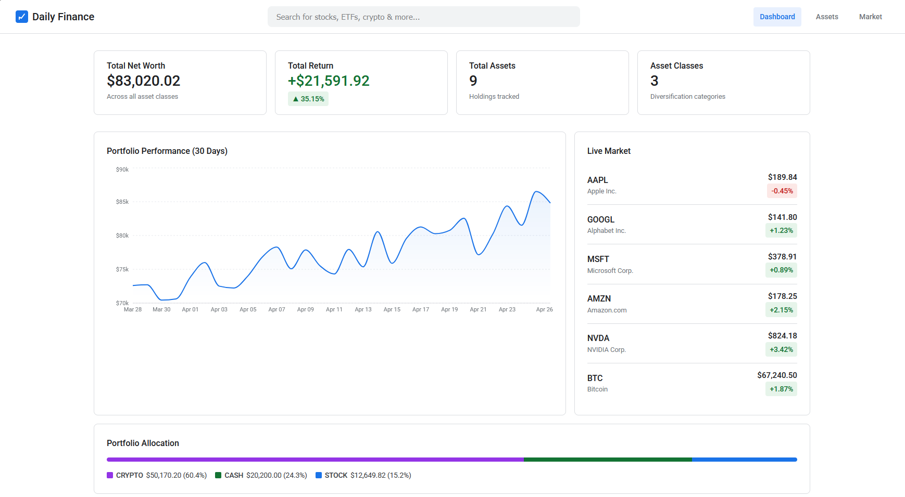
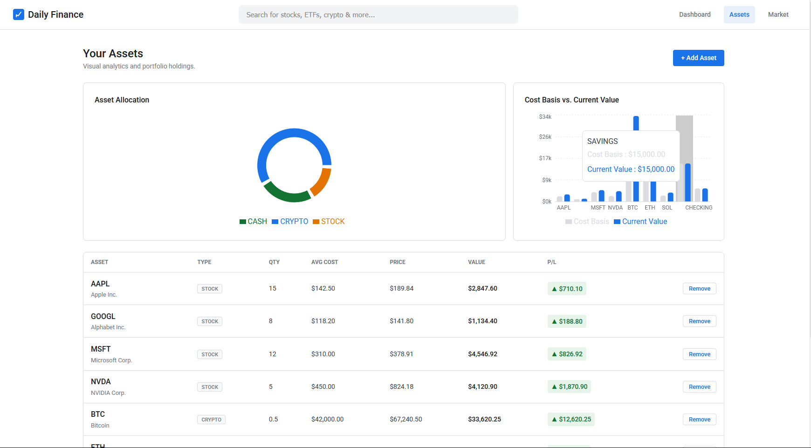
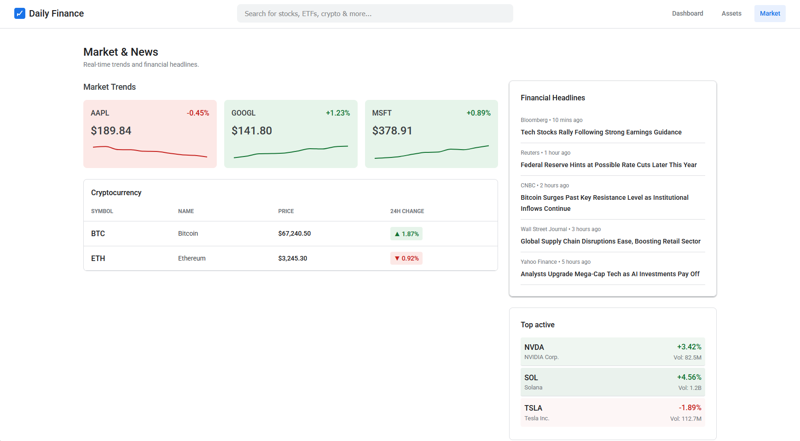

# Daily Finance

A professional-grade, multi-source financial tracking platform. Daily Finance integrates real-time market data, secure portfolio management, and dynamic visual analytics to provide a comprehensive dashboard. Designed to be entirely cost-free, it leverages an AWS LocalStack emulator for local development and adheres to strict AWS Free Tier limits for production deployment.

## Table of Contents

- [Key Features](#key-features)
- [Tech Stack](#tech-stack)
- [Prerequisites](#prerequisites)
- [Getting Started](#getting-started)
- [Architecture](#architecture)
- [Environment Configuration](#environment-configuration)
- [Available Scripts](#available-scripts)
- [Deployment](#deployment)

---

## Key Features

- **Real-Time Data Engine**: A Python-based AWS Lambda function utilizing `yfinance` to fetch live stock and cryptocurrency data.
- **Dynamic Visual Analytics**: Google Finance-inspired UI featuring responsive Sparklines, PieCharts for asset allocation, and BarCharts for cost-basis comparisons using Recharts.
- **Multi-Module Architecture**: A modern React/Redux SPA coupled with a legacy Knockout.js portal, both served by a robust Spring Boot REST API.
- **Cloud-Ready Emulation**: Fully configured LocalStack setup via Docker Compose to mock AWS S3, DynamoDB, and SQS locally without incurring cloud costs.

---

## Tech Stack

- **Languages**: Java 21, Python 3.11, JavaScript (ES6+)
- **Core Backend**: Spring Boot 3.2.5 (Web, Data JPA, Security, Validation)
- **Data Engine**: Python 3.11 (yfinance, requests, boto3)
- **Modern Frontend**: React 18, Vite, Redux Toolkit, Recharts, Axios
- **Legacy Frontend**: Knockout.js 3.5
- **Database**: H2 (In-Memory for rapid dev) & DynamoDB (via LocalStack)
- **Infrastructure**: Docker, AWS LocalStack, AWS CloudFormation

---

## Prerequisites

Ensure you have the following installed before starting:

- **Java Development Kit (JDK)** 21 or higher
- **Node.js** 18 or higher (npm included)
- **Python** 3.9 or higher (pip included)
- **Docker** & **Docker Compose** (Required for LocalStack AWS emulation)
- **AWS CLI** (Optional, for deploying to actual AWS)

---

## Getting Started

Follow these steps to get the entire multi-source architecture running locally.

### 1. Clone the Repository

```bash
git clone https://github.com/your-username/omnitrack.git
cd omnitrack
```

### 2. Start AWS LocalStack Emulator

To avoid AWS charges, we simulate cloud resources (S3, DynamoDB, SQS) locally.

```bash
# From the project root
docker-compose up -d
```
*LocalStack runs on `http://localhost:4566`.*

### 3. Setup the Python Data Engine

Install the required data science and AWS SDK libraries.

```bash
cd backend-python
pip install -r requirements.txt

# Test the real-time fetcher locally
python lambda_handler.py
```

### 4. Start the Java Spring Boot Backend

The backend will automatically connect to LocalStack and initialize an in-memory H2 database seeded with sample portfolio data.

```bash
cd ../backend-java

# macOS/Linux
./mvnw clean spring-boot:run

# Windows
mvnw.cmd clean spring-boot:run
```
*The API is now running at `http://localhost:8080/api/v1`.*

### 5. Start the React Frontend

Open a new terminal window to start the Vite development server.

```bash
cd ../frontend-react
npm install
npm run dev
```
*Open [http://localhost:5173](http://localhost:5173) in your browser to view the Daily Finance dashboard.*

### 6. Access the Legacy Portal

The project includes an "Archived Records" system built in pure HTML/JS for legacy system integration testing.
Simply open `frontend-legacy/index.html` directly in any modern browser.

---

## Architecture

### Directory Structure

```text
omnitrack/
├── backend-java/          # Core Spring Boot API
│   ├── src/main/java/     # Controllers, Services, Repositories, Models
│   ├── src/main/resources/# application.properties, schema
│   └── pom.xml            # Maven dependencies
├── backend-python/        # AWS Lambda Data Engine
│   ├── lambda_handler.py  # Entry point for data fetching/reporting
│   └── requirements.txt   # Python dependencies (yfinance, boto3)
├── frontend-react/        # Modern Dashboard UI
│   ├── src/features/      # Redux Slices (market, portfolio)
│   ├── src/pages/         # React Views (Dashboard, Assets, Market)
│   └── src/index.css      # Google Finance light-mode design system
├── frontend-legacy/       # Legacy Integration
│   └── index.html         # Knockout.js MVVM architecture
├── infrastructure/        # Infrastructure as Code
│   └── cloudformation.yaml# AWS resource definitions
└── docker-compose.yml     # LocalStack configuration
```

### Request Lifecycle & Data Flow

1. **Market Data Ingestion**: The Python Lambda (`lambda_handler.py`) fetches real market prices via `yfinance`.
2. **Client Request**: User opens the React frontend, triggering Redux thunks (`fetchPortfolioSummary`, `fetchMarketPrices`).
3. **API Gateway**: The Vite proxy forwards requests to the Spring Boot `PortfolioController` and `MarketDataController`.
4. **Persistence Layer**: Spring Services interact with `AssetRepository` to query the H2 Database.
5. **UI Rendering**: Redux updates the state, React re-renders the DOM, and Recharts dynamically draws the Sparklines and Pie charts.

### Database Schema (H2 `assets` Table)

| Column           | Type    | Constraints           | Description                    |
| ---------------- | ------- | --------------------- | ------------------------------ |
| `id`             | BIGINT  | PRIMARY KEY, AUTO_INC | Unique asset identifier        |
| `symbol`         | VARCHAR | NOT NULL              | Ticker symbol (e.g., AAPL)     |
| `name`           | VARCHAR | NOT NULL              | Full company/asset name        |
| `type`           | ENUM    | NOT NULL              | STOCK, CRYPTO, CASH, ETF, BOND |
| `quantity`       | DOUBLE  | NOT NULL, POSITIVE    | Amount owned                   |
| `purchase_price` | DOUBLE  | NOT NULL, POSITIVE    | Average cost basis             |
| `current_price`  | DOUBLE  | NULLABLE              | Latest fetched price           |
| `user_id`        | VARCHAR | NULLABLE              | Multitenant owner ID           |

---

## Environment Configuration

Configuration is managed via Spring Boot's `application.properties` located in `backend-java/src/main/resources/`.

### LocalStack / AWS Emulation

The application is pre-configured to point AWS SDK clients to the LocalStack container:

```properties
# Emulated AWS Endpoints
aws.region=us-east-1
aws.s3.endpoint=http://localhost:4566
aws.dynamodb.endpoint=http://localhost:4566
aws.sqs.endpoint=http://localhost:4566

# Dummy credentials for LocalStack
aws.credentials.access-key=test
aws.credentials.secret-key=test
```

### Database

```properties
spring.datasource.url=jdbc:h2:mem:dailyfinance
spring.datasource.driverClassName=org.h2.Driver
spring.jpa.hibernate.ddl-auto=update
```
*Access the H2 Console at `http://localhost:8080/h2-console` (JDBC URL: `jdbc:h2:mem:dailyfinance`, User: `SA`, No password).*

---

## Available Scripts

### Backend (Maven)

| Command                  | Description                                   |
| ------------------------ | --------------------------------------------- |
| `./mvnw spring-boot:run` | Starts the development server on port 8080.   |
| `./mvnw clean compile`   | Cleans target directory and compiles source.  |
| `./mvnw test`            | Runs JUnit and Spring Boot integration tests. |

### Frontend (npm)

| Command           | Description                                         |
| ----------------- | --------------------------------------------------- |
| `npm run dev`     | Starts Vite dev server with HMR on port 5173.       |
| `npm run build`   | Builds the React app for production into `dist/`.   |
| `npm run preview` | Bootstraps a local static server to test the build. |

---

## Deployment

### Production AWS (Free Tier)

When you are ready to move from LocalStack to a real AWS environment, deploy the provided Infrastructure-as-Code template.

1. Ensure your AWS CLI is configured with `aws configure`.
2. Deploy the CloudFormation stack:

```bash
aws cloudformation deploy \
  --template-file infrastructure/cloudformation.yaml \
  --stack-name daily-finance-prod \
  --parameter-overrides Environment=prod \
  --capabilities CAPABILITY_NAMED_IAM
```

This provisions:
- S3 Bucket (`daily-finance-reports-prod`)
- DynamoDB Table (`daily-finance-logs-prod` - OnDemand)
- SQS Queues (`market-data-queue-prod`)
- IAM Roles mapping strictly to Free Tier limits.

### Application Deployment Strategies
- **Frontend**: Deploy the `dist/` folder to Vercel, Netlify, or an S3 bucket configured for static website hosting.
- **Java API**: Containerize with Docker and deploy to AWS Elastic Beanstalk or Render.
- **Python Engine**: Zip `lambda_handler.py` and `requirements.txt` via AWS SAM or the CLI and deploy to AWS Lambda.

---
### Pictures of the website with dummy data



